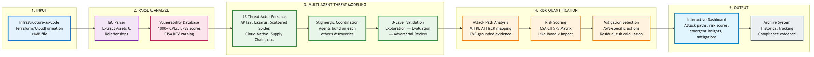
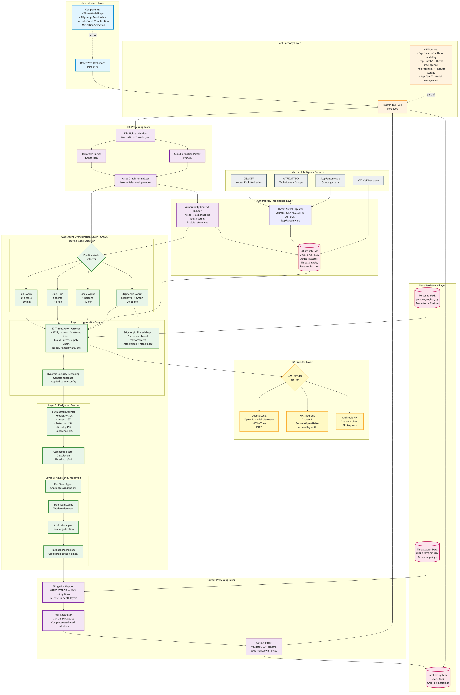

# Documentation Directory

This directory contains comprehensive architecture documentation for the Swarm TM threat modeling platform.

## 📁 Contents

### Architecture Diagrams
- **[ARCHITECTURE.md](ARCHITECTURE.md)** - Master index with viewing instructions and usage guidelines
- **[architecture-simple.md](architecture-simple.md)** - Simplified 5-step architecture (management-focused)
- **[architecture-diagram.md](architecture-diagram.md)** - Detailed technical architecture (9 layers, 60+ components)

### Image Files
- **architecture-simple.png** (82KB) - Simplified diagram, PNG format for presentations
- **architecture-simple.svg** (27KB) - Simplified diagram, SVG format for documents
- **architecture.png** (635KB) - Detailed diagram, PNG format for presentations
- **architecture.svg** (106KB) - Detailed diagram, SVG format for documents

## 🎯 Quick Links

**For Management**: [Simplified Architecture](architecture-simple.md)  
**For Engineers**: [Detailed Architecture](architecture-diagram.md)  
**Usage Guide**: [ARCHITECTURE.md](ARCHITECTURE.md)

## 📊 Diagram Preview

### Simplified Architecture (5-Step Process)

Perfect for executive presentations, board meetings, and sales pitches.

### Detailed Architecture (9-Layer Technical View)

Comprehensive technical documentation for developers and security practitioners.

---

**Last Updated**: 2026-04-27  
**Maintained By**: Swarm TM Development Team
