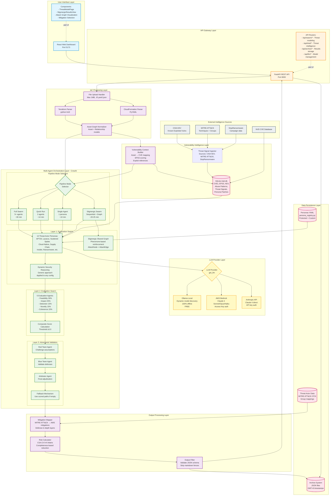

# Swarm TM System Architecture

## High-Level Architecture Diagram

## Component Details

### 1. User Interface Layer
- **Technology**: React 18 + Vite
- **Key Components**:
  - ThreatModelPage: Main threat modeling interface
  - StigmergicResultsView: Results display with emergent insights
  - Attack Graph Visualization: Interactive React Flow graphs
  - Mitigation Selection: Checkbox-based mitigation application

### 2. API Gateway Layer
- **Technology**: FastAPI + Uvicorn
- **Endpoints**:
  - `/api/swarm/run` - Full swarm threat modeling
  - `/api/swarm/run/quick` - Quick run (2 agents)
  - `/api/swarm/run/single` - Single agent mode
  - `/api/swarm/run/stigmergic` - Stigmergic swarm (recommended)
  - `/api/intel/*` - Threat intelligence operations
  - `/api/archive/*` - Save/load threat models
  - `/api/llm/*` - LLM configuration and model listing

### 3. IaC Processing Layer
- **Parsers**:
  - Terraform: python-hcl2 library
  - CloudFormation: PyYAML safe_load
- **Normalizer**: Converts to Asset + Relationship models
- **Output**: Cloud-agnostic graph representation

### 4. Vulnerability Intelligence Layer
- **Database**: SQLite (intel.db)
- **Tables**:
  - cves: CVE entries with CVSS, EPSS, KEV status
  - abuse_patterns: Cloud misconfigurations and exploits
  - threat_intel_signals: Latest threat actor TTPs
  - persona_patches: AI-generated persona updates
- **Context Builder**: Maps assets to relevant CVEs

### 5. Multi-Agent Orchestration Layer
- **Framework**: CrewAI
- **Layer 1 (Exploration)**: 13 threat actor personas with security reasoning
- **Layer 2 (Evaluation)**: 5 specialized scorers with weighted composite scoring
- **Layer 3 (Adversarial)**: Red/Blue team validation + Arbitrator
- **Stigmergic Graph**: Pheromone-based coordination for emergent insights

### 6. LLM Provider Layer
- **Ollama**: Local models, dynamic discovery, 100% offline
- **AWS Bedrock**: Claude 4 models, enterprise auth
- **Anthropic API**: Direct Claude API access

### 7. Output Processing Layer
- **Mitigation Mapper**: MITRE ATT&CK techniques → AWS-specific mitigations
- **Risk Calculator**: CSA CII 5×5 matrix with completeness-based reduction
- **Output Filter**: JSON validation and markdown fence stripping

### 8. Data Persistence Layer
- **Archive System**: JSON files with GMT+8 timestamps
- **Persona YAML**: 13 default (protected) + custom personas
- **Threat Actor Data**: MITRE ATT&CK STIX format

### 9. External Intelligence Sources
- **CISA KEV**: Known Exploited Vulnerabilities catalog
- **MITRE ATT&CK**: Techniques, groups, and campaigns
- **StopRansomware**: Ransomware campaign data
- **NVD**: National Vulnerability Database

## Data Flow Summary

1. **User uploads IaC** → FastAPI receives file
2. **Parse & Normalize** → Terraform/CloudFormation → Asset Graph
3. **Enrich with Vuln Intel** → Query intel.db for CVEs, EPSS, KEV
4. **Select Pipeline Mode** → Full/Quick/Single/Stigmergic
5. **Layer 1: Explore** → 13 personas generate attack paths (with LLM)
6. **Layer 2: Evaluate** → 5 scorers compute composite scores
7. **Layer 3: Validate** → Red/Blue/Arbitrator produce final threat model
8. **Process Output** → Map mitigations, calculate risk, filter JSON
9. **Return Results** → API → React UI displays attack paths, graph, insights
10. **Archive** → Save threat model with timestamp for future reference

## Key Design Principles

1. **Modularity**: Each layer is independently testable and replaceable
2. **Cloud-Agnostic**: Normalized asset graph supports future GCP/Azure parsers
3. **Provider-Agnostic**: LLM abstraction layer supports multiple providers
4. **Stigmergic Intelligence**: Emergent insights from agent coordination
5. **Defense-in-Depth**: Three-layer validation ensures quality
6. **Living Intelligence**: Automatic persona updates from threat signals
7. **Vulnerability-Grounded**: Real CVE/EPSS/KEV data, not theoretical risks
