# Swarm TM Architecture - Management Summary

## Simplified Architecture for Executive Presentations

```mermaid
graph LR
    subgraph "1. INPUT"
        A[Infrastructure-as-Code<br/>Terraform/CloudFormation<br/><1MB file]
    end

    subgraph "2. PARSE & ANALYZE"
        B[IaC Parser<br/>Extract Assets &<br/>Relationships]
        C[Vulnerability Database<br/>1000+ CVEs, EPSS scores<br/>CISA KEV catalog]
    end

    subgraph "3. MULTI-AGENT THREAT MODELING"
        D[13 Threat Actor Personas<br/>APT29, Lazarus, Scattered Spider,<br/>Cloud-Native, Supply Chain, etc.]
        E[Stigmergic Coordination<br/>Agents build on each<br/>other's discoveries]
        F[3-Layer Validation<br/>Exploration → Evaluation<br/>→ Adversarial Review]
    end

    subgraph "4. RISK QUANTIFICATION"
        G[Attack Path Analysis<br/>MITRE ATT&CK mapping<br/>CVE-grounded evidence]
        H[Risk Scoring<br/>CSA CII 5×5 Matrix<br/>Likelihood × Impact]
        I[Mitigation Selection<br/>AWS-specific actions<br/>Residual risk calculation]
    end

    subgraph "5. OUTPUT"
        J[Interactive Dashboard<br/>Attack paths, risk scores,<br/>emergent insights, mitigations]
        K[Archive System<br/>Historical tracking<br/>Compliance evidence]
    end

    A --> B
    B --> C
    C --> D
    D --> E
    E --> F
    F --> G
    G --> H
    H --> I
    I --> J
    J --> K

    style A fill:#e3f2fd,stroke:#1976d2,stroke-width:3px
    style B fill:#f3e5f5,stroke:#7b1fa2,stroke-width:2px
    style C fill:#fce4ec,stroke:#c2185b,stroke-width:2px
    style D fill:#e8f5e9,stroke:#388e3c,stroke-width:3px
    style E fill:#e8f5e9,stroke:#388e3c,stroke-width:3px
    style F fill:#e8f5e9,stroke:#388e3c,stroke-width:3px
    style G fill:#fff3e0,stroke:#f57c00,stroke-width:2px
    style H fill:#fff3e0,stroke:#f57c00,stroke-width:2px
    style I fill:#fff3e0,stroke:#f57c00,stroke-width:2px
    style J fill:#e1f5ff,stroke:#0288d1,stroke-width:3px
    style K fill:#eceff1,stroke:#455a64,stroke-width:2px
```

## 5-Step Process Explanation

### Step 1: INPUT - Infrastructure-as-Code Upload
**What**: User uploads Terraform or CloudFormation file describing their cloud infrastructure  
**Size**: Maximum 1MB (typical production infrastructure)  
**Validation**: File format checked, syntax validated, no code execution  
**Time**: <5 seconds

### Step 2: PARSE & ANALYZE - Asset Discovery
**What**: System parses IaC and normalizes to standard format  
**Output**: Asset graph showing resources (S3 buckets, Lambda functions, IAM roles) and relationships  
**Intelligence**: Queries vulnerability database for relevant CVEs, EPSS exploitation scores, CISA KEV status  
**Time**: ~10 seconds

### Step 3: MULTI-AGENT THREAT MODELING - Swarm Analysis
**What**: 13 threat actor personas explore infrastructure simultaneously (or sequentially in stigmergic mode)  
**Innovation**: Agents coordinate through shared graph, reinforcing high-confidence paths  
**Validation**: 3-layer architecture (Exploration → Evaluation → Adversarial) ensures quality  
**Time**: 14-30 minutes (LLM inference bottleneck, expected for comprehensive analysis)

**Key Personas**:
- **Nation-State APTs**: APT29 (Cozy Bear), Lazarus Group, Volt Typhoon
- **Cybercrime**: FIN7, Scattered Spider, Ransomware Operators
- **Specialized**: Cloud-Native, Supply Chain, Insider Threat, Data Exfiltration

**3-Layer Validation**:
- **Layer 1 (Exploration)**: Multiple personas independently generate attack paths
- **Layer 2 (Evaluation)**: 5 scorers evaluate feasibility, impact, detection, novelty, coherence
- **Layer 3 (Adversarial)**: Red Team challenges, Blue Team defends, Arbitrator adjudicates

### Step 4: RISK QUANTIFICATION - Scoring & Mitigation
**What**: System quantifies risk using CSA CII 5×5 matrix (1-25 scale)  
**Scoring**: Likelihood (1-5) × Impact (1-5) = Risk Score  
**Evidence**: Each attack path linked to specific CVEs with CVSS, EPSS, KEV data  
**Mitigations**: AWS-specific actions with defense-in-depth categorization  
**Residual Risk**: Calculates post-mitigation risk based on selected controls  
**Time**: ~3 seconds

### Step 5: OUTPUT - Results Dashboard
**What**: Interactive web dashboard displays results  
**Views**:
- Threat Model Summary (total paths, risk distribution, coverage %)
- Attack Path Cards (kill chains with MITRE ATT&CK techniques)
- Shared Attack Graph (React Flow visualization with reinforced nodes)
- Emergent Insights (high-confidence techniques, convergent paths, coverage gaps)
- Comprehensive Mitigation Summary (checkbox selection with residual risk)

**Archive**: Results saved with GMT+8 timestamp for compliance/historical tracking  
**Time**: Instant (results rendered client-side)

## Key Differentiators

| Feature | Traditional Tools | Swarm TM |
|---------|------------------|----------|
| **Time** | 2-4 weeks manual | 20-30 minutes automated |
| **Coverage** | Single analyst perspective | 13 threat actor perspectives |
| **Validation** | Peer review (if any) | 3-layer automated validation |
| **Evidence** | Generic recommendations | CVE/EPSS/KEV-grounded |
| **Insights** | Individual analysis | Emergent patterns from coordination |
| **Cost** | $18,000 per model | $300 (2 hr review) + negligible compute |

## Technology Stack Summary

- **Frontend**: React 18 + Vite
- **Backend**: Python 3.11+ FastAPI
- **Multi-Agent**: CrewAI orchestration framework
- **LLM**: Ollama (local), AWS Bedrock, or Anthropic API
- **Database**: SQLite (intel.db for vulnerabilities)
- **Intelligence**: CISA KEV, MITRE ATT&CK, EPSS, NVD

## Deployment Options

1. **Local Development**: Ollama (100% offline, free)
2. **Enterprise Cloud**: AWS Bedrock (Claude 4 models)
3. **Hybrid**: Local frontend + cloud LLM (flexibility)

## Total Time: ~25 Minutes End-to-End

- IaC Upload & Parse: 15 seconds
- Multi-Agent Analysis: 20-25 minutes
- Risk Calculation: 3 seconds
- Results Display: Instant
- **Human Review**: 2 hours (validate results, select mitigations)

**ROI**: $17,700 savings per threat model vs. $18,000 manual process
